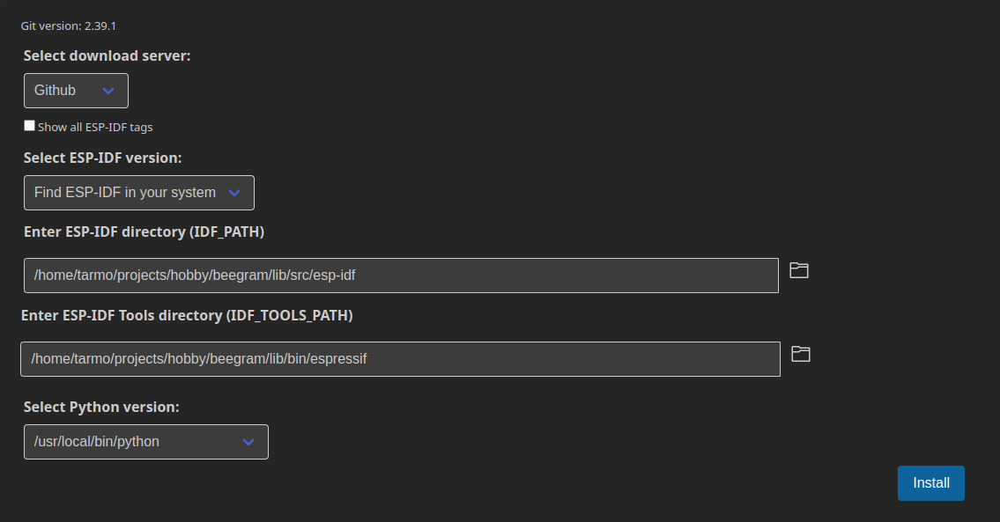
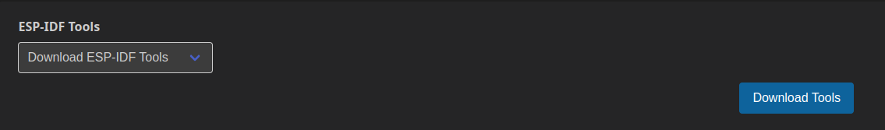

# Bee hive monitoring

This project monitors bee hive weight and internal environment, posting results to cloud.

# Set up development environment

## Install ESP-IDF

Install the latest stable ESP IDF as described in https://docs.espressif.com/projects/esp-idf/en/stable/esp32/get-started/index.html. Quick instructions for Debian 11 Bullseye:

Install requisite packages:

```
$ sudo apt install git wget flex bison gperf python3 python3-venv python3-pip cmake ninja-build ccache libffi-dev libssl-dev dfu-util libusb-1.0-0
```

Download ESP IDF source and install toolchain under the project directory:

```
$ export WORKROOT="$HOME/projects/hobby/beegram" && export IDF_TOOLS_PATH="$WORKROOT/lib/bin/espressif" IDF_PATH="$WORKROOT/lib/src/esp-idf"
$ mkdir -p "$WORKROOT/lib/src" && cd "$WORKROOT/lib/src"
$ git clone -j8 -b v5.0.1 --recursive https://github.com/espressif/esp-idf.git
$ cd esp-idf
$ ./install.sh
$ . export.sh
```

Next time you are starting work on the project, run following commands:

```
$ export WORKROOT="$HOME/projects/hobby/beegram" && export IDF_TOOLS_PATH="$WORKROOT/lib/bin/espressif" IDF_PATH="$WORKROOT/lib/src/esp-idf"
$ . "$IDF_PATH/export.sh"
```

## Get the source of this project

```
$ mkdir -p "$WORKROOT/src" && cd "$WORKROOT/src"
$ git clone git@github.com:DaStoned/beegram.git
```

## Optional: Visual Studio Code setup

Install Visual Studio Code from https://code.visualstudio.com/ and run it.

Install the ESP IDF Extension for VSCode using instructions in https://github.com/espressif/vscode-esp-idf-extension

Notes to complement the official installation process:

1. In command palette run `ESP-IDF: Select where to save configuration settings` and choose "Workspace".
1. Open the workspace in `$WORKROOT/src/beegram/support/vscode`
1. In command palette re-run `ESP-IDF: Configure ESP-IDF extension`
  1. Choose "ADVANCED", then 
  1. Set "Select ESP-IDF version:" as "Find ESP-IDF in your system" 
  1. Enter the paths as values of `$IDF_PATH` and `$IDF_TOOLS_PATH`: 
  1. On the next page you have to choose "Download ESP-IDF Tools" or VSCode won't find the compiler: 

## Optional: Configuration file for tmuxinator

Propping up the development environment automatically is quite simple with tmuxinator.

```
$ sudo apt install tmux tmuxinator
$ mkdir "$HOME/.tmuxinator"
$ vim "$HOME/.tmuxinator/beegram.yml"
```

Content of `$HOME/.tmuxinator/beegram.yml` should be something like this:

```
name: beegram
root: ~/projects/hobby/beegram

pre_window: export WORKROOT="$HOME/projects/hobby/beegram" && export IDF_TOOLS_PATH="$WORKROOT/lib/bin/espressif" IDF_PATH="$WORKROOT/lib/src/esp-idf" ESPBAUD=921600 && . "$IDF_PATH/export.sh"

windows:
  - code:
      layout: main-vertical
      panes:
        - cd src/beegram && git status
        - cd src/beegram
  - sdk:
      layout: main-vertical
      panes:
        - cd "$IDF_PATH" && git status
```
